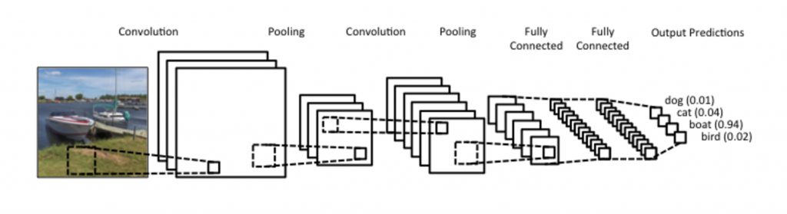

**By **[Denny Britz](https://www.kdnuggets.com/author/denny-britz)**, WildML.**

When we hear about Convolutional Neural Network (CNNs), we typically think of
Computer Vision. CNNs were responsible for major breakthroughs in
Image Classification and are the core of most Computer Vision systems today,
from Facebook’s automated photo tagging to self-driving cars.

More recently we’ve also started to apply CNNs to problems in Natural
Language Processing and gotten some interesting results. In this post I’ll try
to summarize what CNNs are, and how they’re used in NLP. The intuitions behind
CNNs are somewhat easier to understand for the Computer Vision use case, so I’ll
start there, and then slowly move towards NLP.

>   **What is Convolution?**

The for me easiest way to understand a *convolution* is by thinking of it as a
sliding window function applied to a matrix. That’s a mouthful, but it becomes
quite clear looking at a visualization:

  
*Fig.1 Convolution with 3×3 Filter. Source:
http://deeplearning.stanford.edu/wiki/index.php/Feature_extraction_using_convolution*

Imagine that the matrix on the left represents an black and white image. Each
entry corresponds to one pixel, 0 for black and 1 for white (typically it’s
between 0 and 255 for grayscale images). The sliding window is called
a *kernel,* *filter, *or* feature detector.* Here we use a 3×3 filter, multiply
its values element-wise with the original matrix, then sum them up. To get the
full convolution we do this for each element by sliding the filter over
the whole matrix.

You may be wondering wonder what you can actually do with this. Here are some
intuitive examples.

**Averaging each pixel with its neighboring values blurs an image:**

 

**Taking the difference between a pixel and its neighbors detects edges:**

(To understand this one intuitively, think about what happens in parts of the
image that are smooth, where a pixel color equals that of its neighbors: The
additions cancel and the resulting value is 0, or black. If there’s a sharp edge
in intensity, a transition from white to black for example, you get a large
difference and a resulting white value)

 

 

The[ GIMP manual](http://docs.gimp.org/en/plug-in-convmatrix.html) has a few
other examples. To understand more about how convolutions work I also recommend
checking out [Chris Olah’s post on the
topic.](http://colah.github.io/posts/2014-07-Understanding-Convolutions/)

>   **What are Convolutional Neural Networks?**

Now you know what convolutions are. But what about CNNs? CNNs are basically just
several layers of convolutions with *nonlinear activation
functions* like *ReLU* or [tanh](https://reference.wolfram.com/language/ref/Tanh.html) applied
to the results. In a traditional feedforward neural network we connect each
input neuron to each output neuron in the next layer. That’s also called a fully
connected layer, or affine layer. In CNNs we don’t do that. Instead, we use
convolutions over the input layer to compute the output. This results in local
connections, where each region of the input is connected to a neuron in the
output.Each layer applies different filters, typically hundreds or thousands
like the ones showed above, and combines their results. There’s also something
something called pooling (subsampling) layers, but I’ll get into that later.
During the training phase, **a CNN** **automatically learns the values of its
filters**based on the task you want to perform. For example, in Image
Classification a CNN may learn to detect edges from raw pixels in the first
layer, then use the edges to detect simple shapes in the second layer, and then
use these shapes to deter higher-level features, such as facial shapes in higher
layers. The last layer is then a classifier that uses these high-level features.

There are two aspects of this computation worth paying attention to: **Location
Invariance** and **Compositionality**. Let’s say you want to classify whether or
not there’s an elephant in an image. Because you are sliding your filters over
the whole image you don’t really care *where* the elephant occurs. In practice,
 *pooling* also gives you invariance to translation, rotation and scaling, but
more on that later. The second key aspect is (local) compositionality. Each
filter *composes* a local patch of lower-level features into higher-level
representation. That’s why CNNs are so powerful in Computer Vision. It makes
intuitive sense that you build edges from pixels, shapes from edges, and more
complex objects from shapes.

#### So, how does any of this apply to NLP?

Instead of image pixels, the input to most NLP tasks are sentences or documents
represented as a matrix. Each row of the matrix corresponds to one token,
typically a word, but it could be a character. That is, each row is vector that
represents a word. Typically, these vectors are *word
embeddings* (low-dimensional
representations) like [word2vec](https://code.google.com/p/word2vec/) or GloVe,
but they could also be one-hot vectors that index the word into a vocabulary.
For a 10 word sentence using a 100-dimensional embedding we would have a 10×100
matrix as our input. That’s our “image”.

In vision, our filters slide over local patches of an image, but in NLP we
typically use filters that slide over full rows of the matrix (words). Thus, the
“width” of our filters is usually the same as the width of the input matrix. The
height, or *region size*, may vary, but sliding windows over 2-5 words at a time
is typical. Putting all the above together, a Convolutional Neural Network for
NLP may look like this (take a few minutes and try understand this picture and
how the dimensions are computed. You can ignore the pooling for now, we’ll
explain that later):

![Illustration of a Convolutional Neural Network (CNN) architecture for sentence classification. Here we depict three filter region sizes: 2, 3 and 4, each of which has 2 filters. Every filter performs convolution on the sentence matrix and generates (variable-length) feature maps. Then 1-max pooling is performed over each map, i.e., the largest number from each feature map is recorded. Thus a univariate feature vector is generated from all six maps, and these 6 features are concatenated to form a feature vector for the penultimate layer. The final softmax layer then receives this feature vector as input and uses it to classify the sentence; here we assume binary classification and hence depict two possible output states. Source: hang, Y., & Wallace, B. (2015). A Sensitivity Analysis of (and Practitioners’ Guide to) Convolutional Neural Networks for Sentence Classification](media/b8580dbe2b12835fda12966955a33d17.png)

  
*Fig.2 Illustration of a Convolutional Neural Network (CNN) architecture for
sentence classification. Here we depict three filter region sizes: 2, 3 and 4,
each of which has 2 filters. Every filter performs convolution on the sentence
matrix and generates (variable-length) feature maps. Then 1-max pooling is
performed over each map, i.e., the largest number from each feature map is
recorded. Thus a univariate feature vector is generated from all six maps, and
these 6 features are concatenated to form a feature vector for the penultimate
layer. The final softmax layer then receives this feature vector as input and
uses it to classify the sentence; here we assume binary classification and hence
depict two possible output states. Source: Zhang, Y., & Wallace, B. (2015). A
Sensitivity Analysis of (and Practitioners’ Guide to) Convolutional Neural
Networks for Sentence Classification.*

What about the nice intuitions we had for Computer Vision? Location Invariance
and local Compositionality made intuitive sense for images, but not so much for
NLP. You probably do care a lot where in the sentence a word appears. Pixels
close to each other are likely to be semantically related (part of the same
object), but the same isn’t always true for words. In many languages, parts of
phrases could be separated by several other words. The compositional aspect
isn’t obvious either. Clearly, words compose in some ways, like an adjective
modifying a noun, but how exactly this works what higher level representations
actually “mean” isn’t as obvious as in the Computer Vision case.

Given all this, it seems like CNNs wouldn’t be a good fit for NLP
tasks. [Recurrent Neural
Networks](http://www.wildml.com/2015/09/recurrent-neural-networks-tutorial-part-1-introduction-to-rnns/) make
more intuitive sense. They resemble how we process language (or at least how we
think we process language): Reading sequentially from left to
right. Fortunately, this doesn’t mean that CNNs don’t work.  [All models are
wrong, but some are useful](https://en.wikipedia.org/wiki/All_models_are_wrong).
It turns out that CNNs applied to NLP problems perform quite well. The
simple [Bag of Words model](https://en.wikipedia.org/wiki/Bag-of-words_model) is
an obvious oversimplification with incorrect assumptions, but has nonetheless
been the standard approach for years and lead to pretty good results.

A big argument for CNNs is that they are fast. Very fast. Convolutions are a
central part of computer graphics and implemented on a hardware level on GPUs.
Compared to something like [n-grams](https://en.wikipedia.org/wiki/N-gram), CNNs
are also *efficient* in terms of representation. With a large vocabulary,
computing anything more than 3-grams can quickly become expensive. Even Google
doesn’t provide anything beyond 5-grams. Convolutional Filters learn good
representations automatically, without needing to represent the whole
vocabulary. It’s completely reasonable to have filters of size larger than 5. I
like to think that many of the learned filters in the first layer are
capturing features quite similar (but not limited) to n-grams, but represent
them in a more compact way.

### CNN Hyperparameters

Before explaining at how CNNs are applied to NLP tasks, let’s look at some of
the choices you need to make when building a CNN. Hopefully this will help you
better understand the literature in the field.

#### Narrow vs. Wide convolution

When I explained convolutions above I neglected a little detail of how we apply
the filter. Applying a 3×3 filter at the center of the matrix works fine, but
what about the edges? How would you apply the filter to the first element of
a matrix that doesn’t have any neighboring elements to the top and left? You can
use *zero-padding*. All elements that would fall outside of the matrix are
taken to be zero. By doing this you can apply the filter to every element of
your input matrix, and get a larger or equally sized output. Adding zero-padding
is also called *wide convolution***,** and not using zero-padding would be
a* narrow convolution*. An example in 1D looks like this:

*Fig.3 Narrow vs. Wide Convolution. Filter size 5, input size 7. Source: A
Convolutional Neural Network for Modelling Sentences (2014)*

You can see how wide convolution is useful, or even necessary, when you have a
large filter relative to the input size. In the above, the narrow convolution
yields  an output of size 

, and a wide convolution an output of size 

. More generally, the formula for the output size is 

.

#### Stride Size

Another hyperparameter for your convolutions is the *stride size*, defining by
how much you want to shift your filter at each step.  In all the examples above
the stride size was 1, and consecutive applications of the filter overlapped. A
larger stride size leads to fewer applications of the filter and a smaller
output size. The following from the [Stanford cs231
website](http://cs231n.github.io/convolutional-networks/) shows stride sizes of
1 and 2 applied to a one-dimensional input:

**Fig. 4 ***Convolution Stride Size. Left: Stride size 1. Right: Stride size 2.
Source: http://cs231n.github.io/convolutional-networks/*

In the literature we typically see stride sizes of 1, but a larger stride size
may allow you to build a model that behaves somewhat similarly to a [Recursive
Neural Network](https://en.wikipedia.org/wiki/Recursive_neural_network), i.e.
looks like a tree.

#### Pooling Layers

A key aspect of Convolutional Neural Networks are *pooling layers,* typically
applied after the convolutional layers. Pooling layers subsample their input.
The most common way to do pooling it to apply a 

 operation to the result of each filter. You don’t necessarily need to pool over
the complete matrix, you could also pool over a window. For example, the
following shows max pooling for a 2×2 window (in NLP we typically are apply
pooling over the complete output, yielding just a single number for each
filter):

**Fig. 5 ***Max pooling in CNN. Source:
http://cs231n.github.io/convolutional-networks/\#pool*

Why pooling? There are a couple of reasons. One property of pooling is that it
provides a fixed size output matrix, which typically is required for
classification. For example, if you have 1,000 filters and you apply max pooling
to each, you will get a 1000-dimensional output, regardless of the size of your
filters, or the size of your input. This allows you to use variable size
sentences, and variable size filters, but always get the same output dimensions
to feed into a classifier.

Pooling also reduces the output dimensionality but (hopefully) keeps the most
salient information. You can think of each filter as detecting a specific
feature, such as detecting if the sentence contains a negation like “not
amazing” for example. If this phrase occurs somewhere in the sentence, the
result of applying the filter to that region will yield a large value, but a
small value in other regions. By performing the max operation you  are keeping
information about whether or not the feature appeared in the sentence, but you
are losing information about where exactly it appeared. But isn’t this
information about locality really useful? Yes, it  is and it’s a bit similar to
what a bag of n-grams model is doing. You are losing global information about
locality (where in a sentence something happens), but you are keeping local
information captured by your filters, like “not amazing” being very different
from “amazing not”.

In imagine recognition, pooling also provides basic invariance to translating
(shifting) and rotation. When you are pooling over a region, the output will
stay approximately the same even if you shift/rotate the image by a few pixels,
because the max operations will pick out the same value regardless.

#### Channels

The last concept we need to understand are *channels*.* *Channels are different
“views” of your input data. For example, in image recognition you typically have
RGB (red, green, blue) channels. You can apply convolutions across channels,
either with different or equal weights. In NLP you could imagine having various
channels as well: You could have a separate channels for different word
embeddings ([word2vec](https://code.google.com/p/word2vec/) and GloVe for
example), or you could have a channel for the same sentence represented in
different languages, or phrased in different ways.

### Convoltuonal Neural Networks applied to NLP

Let’s now look at some of the applications of CNNs to Natural Language
Processing. I’ll try it summarize some of the research results. Invariably I’ll
miss many interesting applications (do let me know in the comments), but I hope
to cover at least some of the more popular results.

The most natural fit for CNNs seem to be classifications tasks, such as
Sentiment Analysis, Spam Detection or Topic Categorization. Convolutions and
pooling operations lose information about the local order of words, so that
sequence tagging as in PoS Tagging or Entity Extraction is a bit harder to fit
into a pure CNN architecture (though not impossible, you can add positional
features to the input).

[1] Evaluates a CNN architecture on various classification datasets, mostly
comprised of Sentiment Analysis and Topic Categorization tasks. The CNN
architecture achieves very good performance across datasets, and new
state-of-the-art on a few. Surprisingly, the network used in this paper is quite
simple, and that’s what makes it powerful.The input layer is a sentence
comprised of concatenated [word2vec](https://code.google.com/p/word2vec/) word
embeddings. That’s followed by a convolutional layer with multiple filters, then
a max-pooling layer, and finally a softmax classifier.  The paper also
experiments with two different channels in the form of static and dynamic word
embeddings, where one channel is adjusted during training and the other isn’t. A
similar, but somewhat more complex, architecture was previously proposed in
[2]. [6] Adds an additional layer that performs “semantic clustering” to this
network architecture.

**Fig. 6***Kim, Y. (2014). Convolutional Neural Networks for Sentence
Classification*

[4] Trains a CNN from scratch, without the need for for pre-trained word vectors
like word2vec or GloVe. It applies convolutions directly to one-hot vectors. The
author also proposes a space-efficient bag-of-words-like representation for the
input data, reducing the number of parameters the network needs to learn. In [5]
the author  extends the model with an additional unsupervised “region embedding”
that is learned using a CNN  predicting the context of text regions. The
approach in these papers seems to work well for long-form texts (like movie
reviews), but their performance on short texts (like tweets) isn’t clear.
Intuitively, it makes sense that using pre-trained word embeddings for short
texts would yield larger gains than using them for long texts.

Building a CNN architecture means that there are many hyperparameters to choose
from, some of which I presented above: Input represenations (word2vec, GloVe,
one-hot), number and sizes of convolution filters, pooling strategies (max,
average), and activation functions (ReLU, tanh). [7] performs an empirical
evaluation on the effect of varying hyperparameters in CNN architectures,
investigating their impact on performance and variance over multiple runs. If
you are looking to implement your own CNN for text classification, using the
results of this paper as a starting point would be an excellent idea. A few
results that stand out are that max-pooling always beat average pooling, that
the ideal filter sizes are important but task-dependent, and that regularization
doesn’t seem to make a big different in the NLP tasks that were considered. A
caveat of this research is that all the datasets were quite similar in terms of
their document length, so the same guidelines may not apply to data that looks
considerably different.

[8] explores CNNs for  Relation Extraction and Relation Classification tasks. In
addition to the word vectors, the authors use the relative positions of words to
the entities of interest as an input to the convolutional layer. This models
assumes that the positions of the entities are given, and that each example
input contains one relation. [9] and [10] have explored similar models.

Another interesting use case of CNNs in NLP can be found in [11] and [12],
coming out of Microsoft Research. These papers describe how to learn
semantically meaningful representations of sentences that can be used for
Information Retrieval. The example given in the papers includes recommending
potentially interesting documents to users based on what they are currently
reading. The sentence representations are trained based on search engine log
data.

Most CNN architectures learn embeddings (low-dimensional representations) for
words and sentences in one way or another as part of their training procedure.
Not all papers though focus on this aspect of training or investigate how
meaningful the learned embeddings are. [13] presents a CNN architecture to
predict hashtags for Facebook posts, while at the same time generating
meaningful embeddings for words and sentences. These learned embeddings are then
successfully applied to another task – recommending potentially interesting
documents to users, trained based on clickstream data.

#### Character-Level CNNs

So far, all of the models presented were based on words. But there has also been
research in applying CNNs directly to characters. [14] learns character-level
embeddings, joins them with pre-trained word embeddings, and uses a CNN for Part
of Speech tagging. [15][16] explores the use of CNNs to learn directly from
characters, without the need for any pre-trained embeddings. Notably, the
authors use a relatively deep network with a total of 9 layers, and apply it to
Sentiment Analysis and Text Categorization tasks. Results show that learning
directly from character-level input works very well on large datasets (millions
of examples), but underperforms simpler models on smaller datasets (hundreds of
thousands of examples). [17] explores to application of character-level
convolutions to Language Modeling, using the output of the character-level CNN
as the input to an LSTM at each time step. The same model is applied to various
languages.

What’s amazing is that essentially all of the papers above were published  in
the past 1-2 years. Obviously there has been excellent work with CNNs on NLP
before, as in[ Natural Language Processing (almost) from
Scratch](http://arxiv.org/abs/1103.0398), but the pace of new results and state
of the art systems being published is clearly accelerating.

#### Questions or Feedback? Let me know in the comments. Thanks for reading!

#### Paper References

-   [1] [Kim, Y. (2014). Convolutional Neural Networks for Sentence
    Classification. Proceedings of the 2014 Conference on Empirical Methods in
    Natural Language Processing (EMNLP 2014),
    1746–1751.](http://arxiv.org/abs/1408.5882)

-   [2] Kalchbrenner, N., Grefenstette, E., & Blunsom, P. (2014). A
    Convolutional Neural Network for Modelling Sentences. Acl, 655–665.

-   [3] [Santos, C. N. dos, & Gatti, M. (2014). Deep Convolutional Neural
    Networks for Sentiment Analysis of Short Texts. In COLING-2014 (pp.
    69–78).](http://www.aclweb.org/anthology/C14-1008)

-   [4] [Johnson, R., & Zhang, T. (2015). Effective Use of Word Order for Text
    Categorization with Convolutional Neural Networks. To Appear: NAACL-2015,
    (2011).](http://arxiv.org/abs/1412.1058v1)

-   [5] [Johnson, R., & Zhang, T. (2015). Semi-supervised Convolutional Neural
    Networks for Text Categorization via Region
    Embedding.](http://arxiv.org/abs/1504.01255)

-   [6] [Wang, P., Xu, J., Xu, B., Liu, C., Zhang, H., Wang, F., & Hao, H.
    (2015). Semantic Clustering and Convolutional Neural Network for Short Text
    Categorization. Proceedings ACL 2015,
    352–357.](http://www.aclweb.org/anthology/P15-2058)

-   [7] [Zhang, Y., & Wallace, B. (2015). A Sensitivity Analysis of (and
    Practitioners’ Guide to) Convolutional Neural Networks for Sentence
    Classification,](http://arxiv.org/abs/1510.03820)

-   [8] [Nguyen, T. H., & Grishman, R. (2015). Relation Extraction: Perspective
    from Convolutional Neural Networks. Workshop on Vector Modeling for NLP,
    39–48.](http://www.cs.nyu.edu/~thien/pubs/vector15.pdf)

-   [9] [Sun, Y., Lin, L., Tang, D., Yang, N., Ji, Z., & Wang, X. (2015).
    Modeling Mention , Context and Entity with Neural Networks for Entity
    Disambiguation, (Ijcai),
    1333–1339.](http://ijcai.org/papers15/Papers/IJCAI15-192.pdf)

-   [10] [Zeng, D., Liu, K., Lai, S., Zhou, G., & Zhao, J. (2014). Relation
    Classification via Convolutional Deep Neural Network. Coling, (2011),
    2335–2344. ](http://www.aclweb.org/anthology/C14-1220)

-   [11] [Gao, J., Pantel, P., Gamon, M., He, X., & Deng, L. (2014). Modeling
    Interestingness with Deep Neural
    Networks.](http://research.microsoft.com/pubs/226584/604_Paper.pdf)

-   [12] [Shen, Y., He, X., Gao, J., Deng, L., & Mesnil, G. (2014). A Latent
    Semantic Model with Convolutional-Pooling Structure for Information
    Retrieval. Proceedings of the 23rd ACM International Conference on
    Conference on Information and Knowledge Management – CIKM ’14,
    101–110. ](http://research.microsoft.com/pubs/226585/cikm2014_cdssm_final.pdf)

-   [13] [Weston, J., & Adams, K. (2014). \# T AG S PACE : Semantic Embeddings
    from Hashtags, 1822–1827.](http://emnlp2014.org/papers/pdf/EMNLP2014194.pdf)

-   [14] [Santos, C., & Zadrozny, B. (2014). Learning Character-level
    Representations for Part-of-Speech Tagging. Proceedings of the 31st
    International Conference on Machine Learning, ICML-14(2011),
    1818–1826. ](http://jmlr.org/proceedings/papers/v32/santos14.pdf)

-   [15] [Zhang, X., Zhao, J., & LeCun, Y. (2015). Character-level Convolutional
    Networks for Text Classification, 1–9.](http://arxiv.org/abs/1509.01626)

-   [16] [Zhang, X., & LeCun, Y. (2015). Text Understanding from Scratch. arXiv
    E-Prints, 3, 011102.](http://arxiv.org/abs/1502.01710)

-   [17] [Kim, Y., Jernite, Y., Sontag, D., & Rush, A. M. (2015).
    Character-Aware Neural Language Models.](http://arxiv.org/abs/1508.06615)

[Original](http://www.wildml.com/2015/11/understanding-convolutional-neural-networks-for-nlp/).

**Related:**

-   [Recurrent Neural Networks Tutorial,
    Introduction](https://www.kdnuggets.com/2015/10/recurrent-neural-networks-tutorial.html)

-   [Deep Learning Finds What Makes a Good
    \#selfie](https://www.kdnuggets.com/2015/10/karpathy-deep-learning-good-selfie.html)

-   [Excellent Tutorial on Sequence Learning using Recurrent Neural
    Networks](https://www.kdnuggets.com/2015/06/rnn-tutorial-sequence-learning-recurrent-neural-networks.html)
